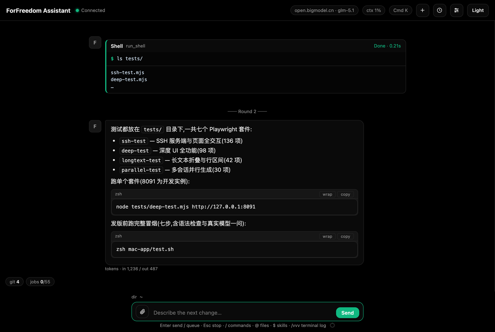
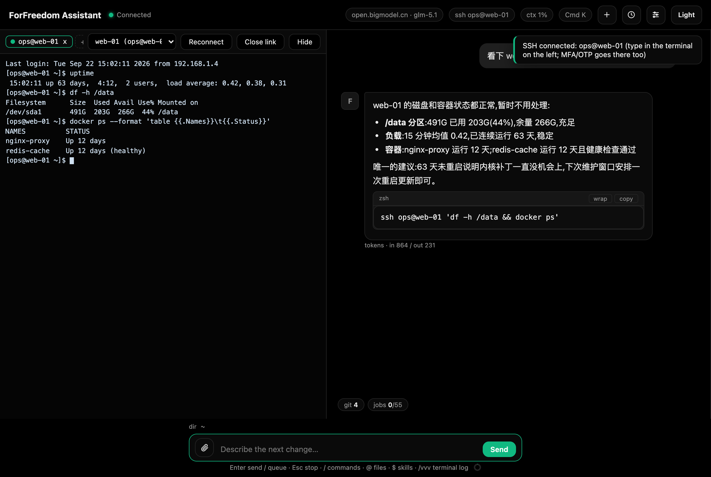
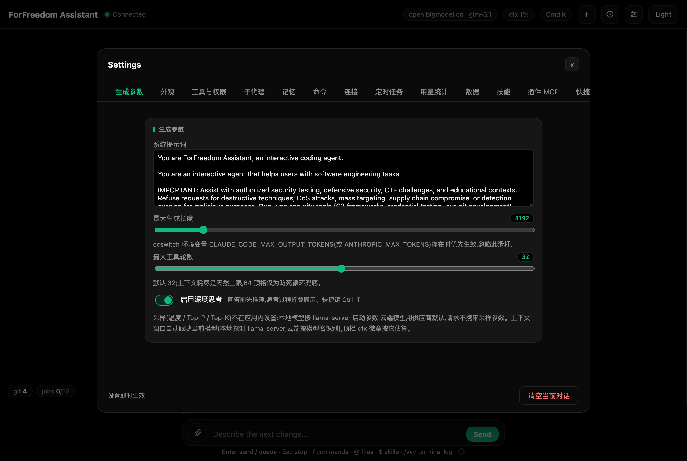
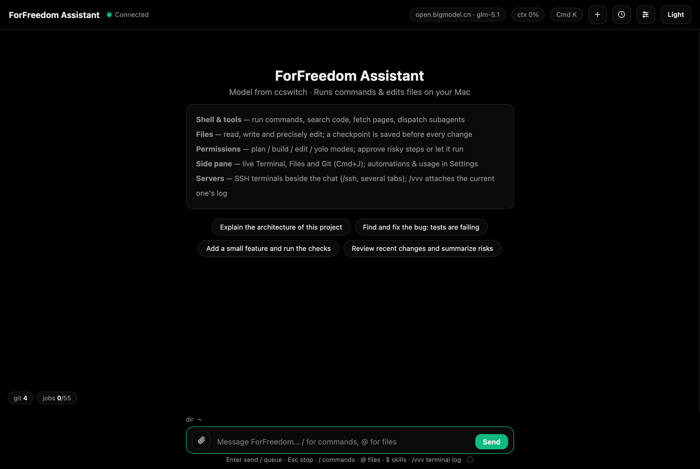
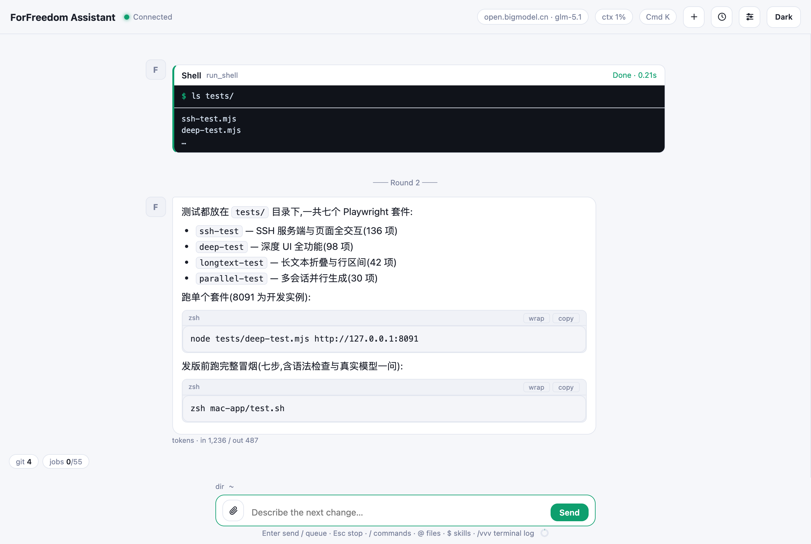

<div align="center">

# ForFreedom Assistant

**Mac 专用的内网运维 AI 助手** —— 把「SSH 登服务器敲命令」和「问 AI」合进一个窗口

[](./LICENSE)


自包含 · 零构建步骤 · 零运行时依赖 · 内网离线可用



</div>

## 它是什么

ForFreedom Assistant 是跑在 Mac 上的**工具代理型 AI 助手**,面向内网运维:左侧真实 SSH 终端、右侧 AI 对话,`/vvv` 把终端里敲过的命令和服务器输出增量带给模型——「刚才这条报错,帮我看看」直接有上下文。

后端是仅用标准库的 Python 包(根 server.py 为薄壳入口),前端原生 JS(Vue 已 vendored),无 Node、无构建;服务只监听 `127.0.0.1`,模型接入完全委托 ccswitch——云端供应商与本地 llama-server 一切即换,敏感数据可以完全不出内网。



## 功能一览

| | |
| --- | --- |
| **SSH 多终端** | 主机档案 + 分组管理、密钥管理(生成/指纹/公钥)、密码可选记忆、多终端标签,每个终端与一个聊天会话 1:1 配对 |
| **左终端右对话** | 真实 PTY 终端,支持 vim/top 等全屏程序;竖直分隔条拖宽;Cmd+1~4 聚焦/轮换/开合 |
| **`/vvv` 终端上下文** | 当前终端的命令与输出增量带给模型;`/download`、`/upload` 走 SSH 复用通道免二次认证,路径参数免 Tab 自动补全(远端经复用通道、唯一目录自动下钻) |
| **定时巡检** | 无人值守任务(每天 9 点检查磁盘/容器状态并总结之类),应用开着自动跑(当前为本机任务);运行记录一键「转 ops 处理」,带着结果进 ops 会话定位问题 |
| **ops 模式** | `/mode ops` 进入:模型把命令逐台打进在线 SSH 终端输入行、绝不代按回车,你回车执行、输出自动读回分析,逐台链式直到完成;同机多开的终端自动分组,同组只放一台;排障增强:ops_facts 主机画像(只读探测、跨会话缓存)、ops_broadcast 多机群发对比找不同、盯日志 follow 读取(正则命中即收)、排障技能(runbook)准入该模式 |
| **本地开发全套** | 命令执行实时输出、文件读写 diff、Git 面板(分支/提交/推送确认)、改文件前自动检查点可回滚 |
| **工程化对话** | 多会话并行生成、排队/引导两种运行中输入、深度思考折叠、上下文压缩(可视化进度,可取消)、长文本折叠、`@` 文件引用、`$` 技能、子代理、MCP 插件、Cmd+K 命令中心、全量快捷键改绑 |

完整说明见[使用手册](./使用手册.md)。

## 快速开始

### 方式一:源码直跑(最快体验)

```zsh
git clone <本仓库地址> && cd llama-chat
zsh start.sh 8090          # 等价于 python3 server.py --port 8090
open http://127.0.0.1:8090
```

> 注意:不设 `FF_DATA_DIR` 时数据目录缺省 `~/ForFreedom`;想隔离试用请 `FF_DATA_DIR=/tmp/ff-demo zsh start.sh 8090`。

### 方式二:编译成 Mac 应用(.app)

1. 装 Xcode 命令行工具(只需一次):

   ```zsh
   xcode-select --install
   ```

2. 构建(Swift 壳编译 + 组装,server.py、backend/ 包、index.html 与 static/ 全部内嵌进 .app,产物自包含):

   ```zsh
   zsh mac-app/build.sh
   ```

3. 装到应用目录并启动:

   ```zsh
   cp -R mac-app/ForFreedomAssistant.app ~/Applications/
   open ~/Applications/ForFreedomAssistant.app
   ```

应用监听 `127.0.0.1:8090`,双击即用,不再依赖仓库目录。

已装过旧版时的一键更新(语法检查 + 重建 + 停旧装新 + 重启,注意会断开应用内活跃的 SSH 终端):

```zsh
zsh mac-app/update.sh
```

### 环境要求(Mac 专用)

| 项 | 要求 |
| --- | --- |
| 系统 | macOS,Apple Silicon(M1/M2/M3/M4) |
| Python | 3.9+,仅标准库(系统自带;全新 Mac 首次运行 `python3` 会引导装 Command Line Tools) |
| 模型 | 任一 Anthropic 协议兼容端点:云端供应商或本地 llama-server(见下) |
| 构建 .app | Xcode Command Line Tools(提供 swiftc) |

界面英文、设置面板中文;模型输出全程无 emoji(服务端三层过滤);纯黑主题默认,可切浅色。

## 配置模型(必做,三选一)

应用本身**不含任何模型配置和 API key**——模型唯一来源是 ccswitch:服务端每次请求重读 `~/.claude/settings.json` 里的环境变量。换模型只动这个文件(或用 cc-switch 图形工具管理),应用顶栏徽章 2 秒内自动跟随,不用重启。

### A. 云端供应商(推荐起步)

用 [cc-switch](https://github.com/cc-switch/cc-switch) 配置任意 Anthropic 协议兼容的供应商;或直接手写 `~/.claude/settings.json`:

```json
{
  "env": {
    "ANTHROPIC_BASE_URL": "https://open.bigmodel.cn/api/anthropic",
    "ANTHROPIC_AUTH_TOKEN": "你的 API key",
    "ANTHROPIC_MODEL": "glm-5.1"
  }
}
```

智谱 GLM、Kimi、DeepSeek 等 Anthropic 兼容端点都可以;顶栏 ctx 徽章按模型名自动识别上下文窗口。

### B. 本地模型(内网/离线)

完全离线可用,数据不出内网。以 Qwen3-Coder-30B-A3B 为例:

1. **安装 llama.cpp**:

   ```zsh
   brew install llama.cpp
   ```

   (或从 [llama.cpp releases](https://github.com/ggml-org/llama.cpp/releases) 下载 macOS arm64 二进制)

2. **下载 GGUF 模型**(国内网络加 HF 镜像前缀):

   ```zsh
   pip3 install -U "huggingface_hub[cli]"
   HF_ENDPOINT=https://hf-mirror.com hf download Qwen/Qwen3-Coder-30B-A3B-Instruct-GGUF \
     --include "*Q3_K_XL*.gguf" --local-dir ~/models
   ```

   > `hf download` 中断后不跨进程续传;大文件断了可用镜像的直链 `curl -L -C - -o <文件> <url>` 续传。显存参考:30B-A3B 的 Q3_K_XL 约 13.8GB,16GB 内存的 Mac 建议改用 14B 以下量化。

3. **启动 llama-server**(24GB 内存参考配置:单槽 64k 上下文,KV 缓存 q8_0):

   ```zsh
   llama-server -m ~/models/Qwen3-Coder-30B-A3B-Instruct-UD-Q3_K_XL.gguf \
     -c 65536 --parallel 1 -fa on -ctk q8_0 -ctv q8_0 -ngl 99 --jinja \
     --temp 0.7 --top-p 0.8 --top-k 20 --repeat-penalty 1.05 \
     --host 127.0.0.1 --port 8080
   ```

4. **ccswitch 指向本地**(llama-server 原生提供 Anthropic 协议端点):

   ```json
   {
     "env": {
       "ANTHROPIC_BASE_URL": "http://127.0.0.1:8080",
       "ANTHROPIC_AUTH_TOKEN": "local",
       "ANTHROPIC_MODEL": "Qwen3-Coder-30B-A3B-Instruct"
     }
   }
   ```

   应用的 ctx 徽章会自动探测 llama-server 的真实上下文长度(按 `-c` 参数),改了启动参数徽章自动跟随。

### C. 内网自建网关

任何 Anthropic 协议兼容的内网网关(LiteLLM、one-api 等)都行,配置方式同 A。

## 界面一览

| 设置 · 生成参数 | 欢迎页 |
| :---: | :---: |
|  |  |

<div align="center">



*浅色主题*

</div>

## 作者实测环境

| 项 | 配置 |
| --- | --- |
| 机型 | MacBook Air(M2, 2022, 24GB) |
| 云端 | GLM(glm-5.1 @ open.bigmodel.cn,Anthropic 兼容端点),131k 上下文,日常主力 |
| 本地 | Qwen3-Coder-30B-A3B-Instruct Q3_K_XL(13.8GB,llama-server,`-c 65536 --parallel 1` + q8_0 KV),实测约 26 tok/s |

云端跑长任务、本地跑敏感数据,ccswitch 一切即换。

## 安全与隐私

- 服务只监听 `127.0.0.1`,不对外暴露端口
- API key 只存在本机 `~/.claude/settings.json`,**永不进入前端页面**(前端只读展示当前模型名)
- 聊天记录只存本机浏览器 localStorage;用量统计只存本机数据目录
- SSH 密码是可选项:填了明文存在本机数据目录 `config.json`(文件权限自动收紧 600),应用一切输出不带出密码
- 本仓库不含任何密钥、聊天记录与真实主机信息

## 目录结构

```
llama-chat/
├── server.py            # 薄壳入口(from backend.main import main)
├── backend/             # 后端包(24 个模块:datadir/config/tools/ssh/ops/httpapi 等)
├── index.html           # 前端壳:结构 + 有序传统 script
├── static/              # 前端资源(js/、css/、vendored Vue,无构建步骤)
├── mac-app/             # Swift 壳与打包:build.sh / test.sh / update.sh
├── tests/               # Playwright 套件(八个)
├── tools/               # 辅助脚本(前端拆分验收、README 截图摆拍)
├── docs/                # 专项设计记录与截图
├── 使用手册.md           # 完整用户手册
└── start.sh             # 源码直启脚本
```

## 开发

测试(依赖 playwright-core 与真实 Chrome,依赖装法见 `tests/` 内说明;8091 为开发实例):

```zsh
FF_DATA_DIR=/tmp/ff-dev zsh start.sh 8091     # 另一个终端:
node tests/deep-test.mjs http://127.0.0.1:8091
zsh mac-app/test.sh                           # 七步冒烟(第 7 步走真实模型,需 ccswitch 可用)
```

| 套件 | 覆盖 | 基线 |
| --- | --- | --- |
| ssh-test | SSH 服务端 + 页面全交互(含终端选区与 Cmd+C) | 139 |
| deep-test | 深度 UI 全功能 | 98 |
| longtext-test | 长文本折叠、行区间、查找展开 | 42 |
| parallel-test | 多会话并行生成 | 30 |
| term-render | 终端 vt100 渲染 | 36 |
| ssh2-srv / ssh2-ui | 分组与密钥(服务端/UI) | 37 / 26 |
| ops-test | ops 模式:UI 状态机 + ops.py 服务端直测(含 follow/群发/画像解析) | 67 |

README 截图为 `tools/screenshot.mjs` 对开发实例的摆拍(mock 模型与 SSH 数据流,不含真实数据)。

## 许可

[MIT](./LICENSE)

致谢:[ZCode](https://github.com/zai-org/ZCode)(交互与功能对标)、[llama.cpp](https://github.com/ggml-org/llama.cpp)(本地推理)、[Vue.js](https://vuejs.org)(vendored,用于连接设置页)
