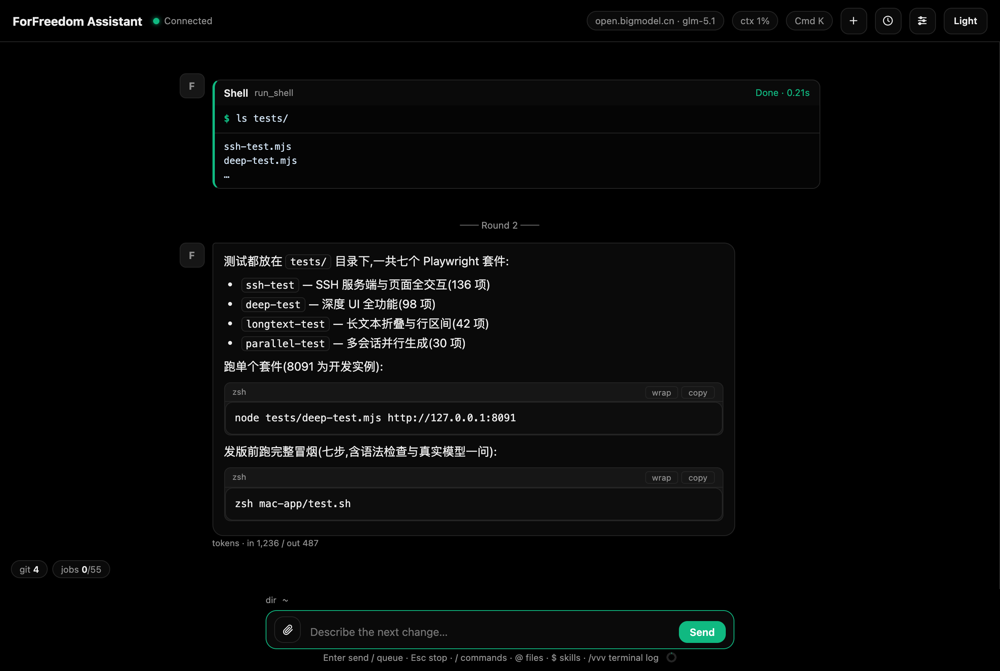
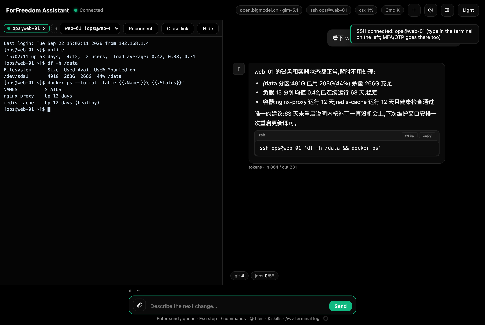
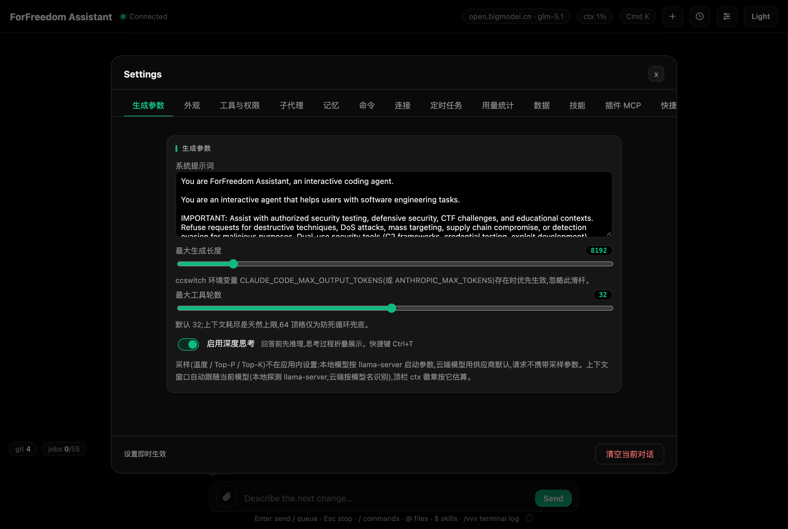
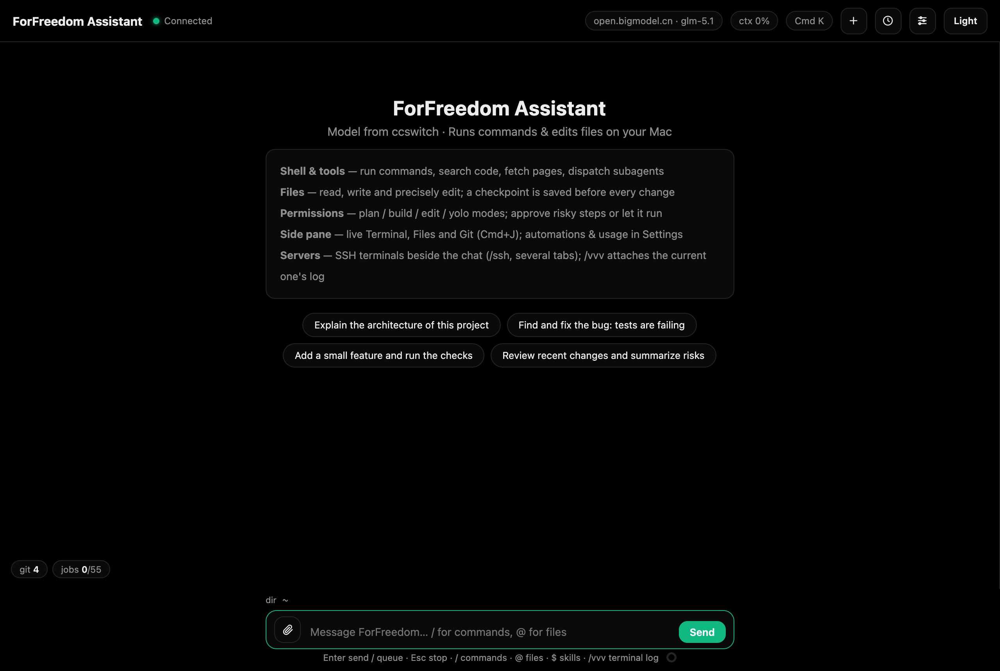
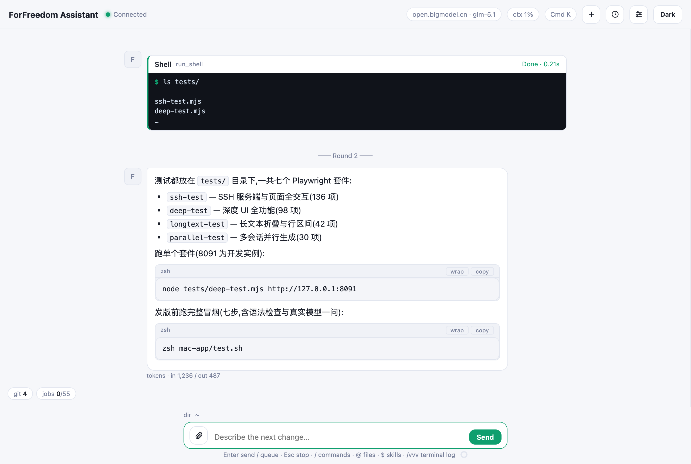

<div align="center">

# ForFreedom Assistant

**A Mac-native AI ops copilot for intranet operations** — an SSH terminal and "ask the AI" in one window

**Mac 专用内网运维 AI 助手**:左侧真实 SSH 终端、右侧 AI 对话,ops / aiops 模式让模型直接驱动终端——命令它来放,回车你来按

[](./LICENSE)


**English** · [简体中文](./README.zh-CN.md)

Self-contained · zero build steps · zero runtime dependencies · works fully offline on an intranet



</div>

## What it is

ForFreedom Assistant is a **tool-agent AI assistant** that runs on your Mac, built for intranet ops: a real SSH terminal on the left, an AI chat on the right. One shortcut (Cmd/Ctrl+Shift+T) grabs the terminal's latest output as a quote for the model — "this error just happened, look at it" comes with context attached. One step further, **ops / aiops modes let the model drive your terminals itself**: probe commands run automatically, repair commands wait for your Enter one by one (see [The two ops modes](#the-two-ops-modes-ops--aiops)).

The backend is a Python package using only the standard library (root `server.py` is a thin shell); the frontend is vanilla JS (Vue vendored) — no Node, no build step. The server listens on `127.0.0.1` only, and model access is fully delegated to ccswitch: cloud providers and a local llama-server are one switch apart, so sensitive data never has to leave your intranet.



## Feature overview

| | |
| --- | --- |
| **SSH multi-terminal** | Host profiles + groups, key management (generate/fingerprint/public key), optional password memory, environment tags/color dots, Cmd+K quick connect, terminal tabs; each terminal pairs 1:1 with a chat session |
| **Terminal left, chat right** | Real PTY terminals; fullscreen apps like vim/top work; draggable vertical splitter; Cmd+1~4 focus/rotate/open-close |
| **Terminal context quoting** | Cmd/Ctrl+Shift+T captures a terminal's new output as a quote chip for the model; `/download`, `/upload` ride the SSH multiplexed channel (no second auth), path args auto-complete without Tab |
| **Scheduled inspections** | Unattended tasks (e.g. check disk/container status daily at 9:00 and summarize) run while the app is open; run records convert to an ops session with one click |
| **ops mode** | `/mode ops`: the model types each command into a live SSH terminal's **input line and never presses Enter** — you review and press Enter, output is read back automatically, host by host until done. Extras: `ops_facts` host profiling (read-only, cached), `ops_broadcast` multi-host fan-out diffing, follow log watching (regex hit collects, timeout auto-Ctrl+C, panel stop button), ops runbook skills |
| **aiops mode** | `/mode aiops`: the accelerated variant — read-only probe commands auto-execute (segment-wise classification + write blacklist, recursive into wrappers/`sh -c`/`docker exec` payloads), while writes/changes still wait for your Enter one by one: probe, conclude, then repair |
| **Full local dev kit** | Live command output, file read/write diffs, Git panel (branch/commit/push confirmations), auto checkpoints before edits with rollback |
| **Engineering-grade chat** | Parallel sessions, queued/steering input while running, collapsible deep thinking, context compaction (visual progress, cancelable), long-text folding, `@` file refs, `$` skills, subagents, MCP plugins, Cmd+K command center, full hotkey rebinding |

The full user manual is currently Chinese: [使用手册](./使用手册.md) (contributions to translate it are welcome).

## The two ops modes: ops and aiops

The split view is the base; the killer feature is the two "model drives the terminal" modes — the model stops merely *watching* the terminal and works on it directly, with execution authority handed back to you in layers.

### ops mode: the model places commands, your Enter is the review

Enter with `/mode ops` (needs at least one live SSH terminal). The loop: the model types a command into a terminal's **input line — it never presses Enter for you**; you read it, press Enter yourself, and only then it runs; the output is read back to the model automatically, which analyzes it and places the next command, host by host until the task is done. Every step's execution authority stays with you — your Enter is the human review. Includes `ops_facts` host profiling, `ops_broadcast` multi-host fan-out comparison, log-follow reading, and runbook skill admission.

### aiops mode: probes without Enter, writes with review

Enter with `/mode aiops`, the accelerated variant — **pure read-only probe commands execute automatically with Enter included, while any write/change still waits for your Enter one by one**. For "let the model find out what's wrong by itself; I only gate the repairs": dozens of read-only probes run continuously without waiting for you, and the genuinely dangerous writes never skip review.

| | ops | aiops |
| --- | --- | --- |
| Probe/inspection commands | Placed in the input line, wait for your Enter | **Auto-execute**, run continuously until a conclusion |
| Write/change commands | Placed in the input line, wait for your Enter | Same: placed one by one, you review each, press Enter each |
| Rhythm | One Enter per step | Probe (no Enter) → conclusion → repair (per-action review) |

Auto-execution uses "allow by default, route writes to review": pipes and `&&`/`;` chains are classified segment-wise; unknown diagnostic tools (`tcpdump`/`strace`/`nmap`/`ethtool`…) are allowed; write-verb blacklist (`rm`/`chmod`/`kill`/`reboot`/`apt`/`kubectl apply`…), anything not statically decidable (`python3 -c`/`sh -c`/`mysql -e`…), and write redirects/heredocs always go to human review; `nohup rm`, `xargs rm`, and `docker exec` inner payloads recurse through the same classifier.

Both modes are sticky per session and restore their waiting state on refresh; full rules in the manual (Chinese): [Manual · 09 Remote servers](./docs/manual/09-远程服务器-SSH.md).

## How it differs from neighbors

| | Termius / Netcatty (SSH clients) | Claude Code etc. (general AI assistants) | ForFreedom Assistant |
| --- | --- | --- | --- |
| Real SSH terminal | Yes | No | Yes (PTY; vim/top fullscreen apps work) |
| AI drives the terminal | No — you type | Nothing to drive | **ops / aiops two-level driving modes** |
| Human-review granularity | n/a | Command/file-level approval | **Enter-level: the model places the command, the Enter key is always yours**; in aiops, read-only probes skip Enter, writes are reviewed one by one |
| Data & network | Mostly cloud-synced accounts | Cloud | **100% local data; local llama-server for full offline use — sensitive data never leaves the intranet** |
| Built for | Connecting to servers | Writing code | **Daily ops: troubleshooting, inspections, multi-host diffing, log watching** |

## Quick start

### Option 1: download the prebuilt app (fastest)

1. Grab the latest `ForFreedomAssistant-*.zip` (Apple Silicon) from [Releases](https://github.com/lrange2001/OpsAssistant/releases/latest);
2. Unzip and drag `ForFreedomAssistant.app` into Applications;
3. Clear the download quarantine once (unsigned build — without this, macOS reports the app as "damaged"):

   ```zsh
   xattr -dr com.apple.quarantine /Applications/ForFreedomAssistant.app
   ```

   Alternatively: double-click once (it gets blocked), then System Settings → Privacy & Security → Open Anyway. Afterwards it opens normally.

The app is self-contained (`server.py`, backend, and frontend are all bundled) — no Python dependencies to install. Model setup below.

### Option 2: run from source

```zsh
git clone https://github.com/lrange2001/OpsAssistant.git && cd OpsAssistant
zsh start.sh 8090          # equivalent to python3 server.py --port 8090
open http://127.0.0.1:8090
```

> Note: without `FF_DATA_DIR`, the data directory defaults to `~/ForFreedom/assisdata` (persistent across reboots; the location is recorded in `~/.assistant_config`, changeable in Settings with full migration — avoid volatile spots like `/tmp`). For a sandboxed trial: `FF_DATA_DIR=/tmp/ff-demo zsh start.sh 8090`.

### Option 3: build the Mac app yourself (.app)

1. Install Xcode Command Line Tools (once):

   ```zsh
   xcode-select --install
   ```

2. Build (Swift shell compile + assembly; `server.py`, the `backend/` package, `index.html`, and `static/` are all embedded — the output is self-contained):

   ```zsh
   zsh mac-app/build.sh
   ```

3. Install and launch:

   ```zsh
   cp -R mac-app/ForFreedomAssistant.app ~/Applications/
   open ~/Applications/ForFreedomAssistant.app
   ```

The app listens on `127.0.0.1:8090`, launches by double-click, and no longer depends on the repo directory.

One-shot update when a previous version is installed (syntax check + rebuild + swap + relaunch; note it disconnects live SSH terminals in the app):

```zsh
zsh mac-app/update.sh
```

### Requirements (Mac only)

| Item | Requirement |
| --- | --- |
| OS | macOS, Apple Silicon (M1/M2/M3/M4) |
| Python | 3.9+, standard library only (preinstalled; a fresh Mac's first `python3` run guides you to install Command Line Tools) |
| Model | Any Anthropic-protocol-compatible endpoint: a cloud provider or a local llama-server (below) |
| Building the .app | Xcode Command Line Tools (provides swiftc) |

UI is English, the settings panel is Chinese; model output is emoji-free (server-side triple filtering); pure-black theme by default, light theme available.

## Model setup (required, pick one)

The app itself **ships with no model configuration and no API key** — the single source of models is ccswitch: the server re-reads environment variables from `~/.claude/settings.json` on every request. Switching models means touching only that file (or managing it with the cc-switch GUI); the top-bar badge follows within 2 seconds, no restart.

### A. Cloud provider (recommended start)

Use [cc-switch](https://github.com/cc-switch/cc-switch) to configure any Anthropic-protocol-compatible provider; or hand-write `~/.claude/settings.json`:

```json
{
  "env": {
    "ANTHROPIC_BASE_URL": "https://open.bigmodel.cn/api/anthropic",
    "ANTHROPIC_AUTH_TOKEN": "your API key",
    "ANTHROPIC_MODEL": "glm-5.1"
  }
}
```

Any Anthropic-compatible endpoint works (GLM, Kimi, DeepSeek, …); the top-bar ctx badge auto-detects the context window by model name.

### B. Local model (intranet / offline)

Fully offline — data never leaves your intranet. Example with Qwen3-Coder-30B-A3B:

1. **Install llama.cpp**:

   ```zsh
   brew install llama.cpp
   ```

   (or grab a macOS arm64 binary from [llama.cpp releases](https://github.com/ggml-org/llama.cpp/releases))

2. **Download a GGUF model** (add an HF mirror prefix on restricted networks):

   ```zsh
   pip3 install -U "huggingface_hub[cli]"
   HF_ENDPOINT=https://hf-mirror.com hf download Qwen/Qwen3-Coder-30B-A3B-Instruct-GGUF \
     --include "*Q3_K_XL*.gguf" --local-dir ~/models
   ```

   > `hf download` cannot resume across processes; for big files interrupted mid-way, resume with `curl -L -C - -o <file> <url>` against the mirror's direct link. VRAM note: Q3_K_XL of 30B-A3B is ~13.8GB; on a 16GB Mac prefer a quant under 14B.

3. **Start llama-server** (reference for 24GB RAM: single slot, 64k context, q8_0 KV cache):

   ```zsh
   llama-server -m ~/models/Qwen3-Coder-30B-A3B-Instruct-UD-Q3_K_XL.gguf \
     -c 65536 --parallel 1 -fa on -ctk q8_0 -ctv q8_0 -ngl 99 --jinja \
     --temp 0.7 --top-p 0.8 --top-k 20 --repeat-penalty 1.05 \
     --host 127.0.0.1 --port 8080
   ```

4. **Point ccswitch at it** (llama-server natively speaks the Anthropic protocol):

   ```json
   {
     "env": {
       "ANTHROPIC_BASE_URL": "http://127.0.0.1:8080",
       "ANTHROPIC_AUTH_TOKEN": "local",
       "ANTHROPIC_MODEL": "Qwen3-Coder-30B-A3B-Instruct"
     }
   }
   ```

   The ctx badge probes llama-server's real context length (from `-c`); change the launch flags and the badge follows.

### C. Self-hosted intranet gateway

Any Anthropic-protocol-compatible intranet gateway (LiteLLM, one-api, …) works; configure as in A.

## Interface

| Settings · generation params | Welcome |
| :---: | :---: |
|  |  |

<div align="center">



*Light theme*

</div>

## Author's daily-driver setup

| Item | Configuration |
| --- | --- |
| Machine | MacBook Air (M2, 2022, 24GB) |
| Cloud | GLM (glm-5.1 @ open.bigmodel.cn, Anthropic-compatible endpoint), 131k context, daily driver |
| Local | Qwen3-Coder-30B-A3B-Instruct Q3_K_XL (13.8GB, llama-server, `-c 65536 --parallel 1` + q8_0 KV), ~26 tok/s measured |

Cloud for long tasks, local for sensitive data — ccswitch switches in one move.

## Security & privacy

- The server listens on `127.0.0.1` only; no port is exposed
- API keys live only in `~/.claude/settings.json` and **never reach the frontend** (the UI shows only the current model name)
- Chat history stays in the browser's localStorage; usage stats stay in the local data directory
- SSH passwords are optional: if provided, they're stored plaintext in the local data directory's `config.json` (permissions tightened to 600), and never leave the machine through app output
- This repository contains no keys, chat logs, or real host information

## Repository layout

```
OpsAssistant/
├── server.py            # thin shell entry (from backend.main import main)
├── backend/             # backend package (24 modules: datadir/config/tools/ssh/ops/httpapi, …)
├── index.html           # frontend shell: structure + ordered classic scripts
├── static/              # frontend assets (js/, css/, vendored Vue; no build step)
├── mac-app/             # Swift shell & packaging: build.sh / test.sh / update.sh
├── tests/               # Playwright suites (eight)
├── tools/               # helper scripts (split verification, README screenshots)
├── docs/                # design notes & screenshots
├── 使用手册.md           # full user manual (Chinese)
└── start.sh             # run-from-source script
```

## Development

Tests (need playwright-core and a real Chrome; see notes in `tests/`; 8091 is the dev instance):

```zsh
FF_DATA_DIR=/tmp/ff-dev zsh start.sh 8091     # in another terminal:
node tests/deep-test.mjs http://127.0.0.1:8091
zsh mac-app/test.sh                           # seven-step smoke (step 7 hits a real model, needs ccswitch)
```

| Suite | Coverage | Baseline |
| --- | --- | --- |
| ssh-test | SSH server + full page interaction (terminal quoting, selection, Cmd+C) | 168 |
| deep-test | deep UI, all features | 99 |
| longtext-test | long-text folding, line ranges, find-and-expand | 42 |
| parallel-test | multi-session parallel generation | 30 |
| term-render | terminal vt100 rendering | 36 |
| ssh2-srv / ssh2-ui | groups & keys (server/UI) | 37 / 26 |
| ops-test | ops mode: UI state machine + direct ops.py server tests (follow/broadcast/facts parsing) | 110 |

README screenshots are staged by `tools/screenshot.mjs` against a dev instance (mock model and SSH data streams; no real data).

## License

[MIT](./LICENSE)

Acknowledgments: [ZCode](https://github.com/zai-org/ZCode) (interaction & feature benchmark), [llama.cpp](https://github.com/ggml-org/llama.cpp) (local inference), [Vue.js](https://vuejs.org) (vendored, powers the connection settings page)
