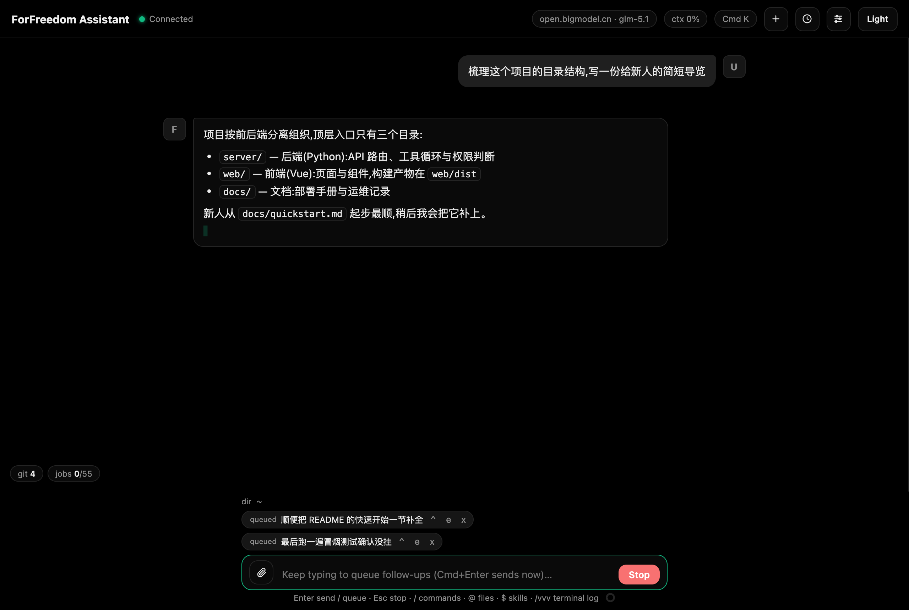

# 对话与输入

### 发送与停止

- **Enter** 发送;**Shift+Enter** 换行;**Esc** 停止生成(只停当前会话的流,见下节"多会话并行生成")。
- **中文输入法**:拼音组合中按 Enter = 确认候选词上屏(走组合收尾,不会误发消息);确认后再按一次 Enter 才发送。
- **输入框旁用量圆环**:提示行末尾的小圆环按当前会话上下文占用填充(已用 / 当前模型窗口),到 85% 变红(与 ctx 徽章同口径);悬停看 已用/总共 tokens、本会话 in/out、累计轮次与 tokens、连续使用天数、最常用模型。
- **中断不丢内容**:Esc 停止(或断流/出错)时,多轮工具回合里**已完成的每一轮都完整保留**(含工具卡与结果),只有正在生成的最后一轮截断;续问时这些内容都会带给模型,不会丢上文。中断的回复按 Claude 方式纯截断——已生成内容原样保留,不再附加 stopped / interrupted 文字标注;完全没有输出的空中断才显示一条本地提示(不进模型上下文)。
- 生成中继续输入再按 Enter = **排队**(不打断当前回答;队列随会话,见下节)。排队的消息显示为 chips:
  - `^` 立即发送(会先中断当前生成,已生成的部分保留)
  - `e` 取回编辑
  - `x` 移除
  - **暂停**:手动停止后队列自动暂停("queue paused after stop");回合出错也会暂停,文案会说明内容没丢("last reply errored (queued messages kept)")。点 "resume" 恢复逐条发送。
  - **发送确认**:队列处于暂停且非空时,再输入新消息回车会弹确认——Clear queue & send(丢弃队列立即发送)/ Keep queue & send(队列保留暂停态,新消息立即发)/ Cancel(Esc,草稿留在输入框)。
- **运行中输入模式**(设置 > 外观):排队(默认)或引导。**引导**模式下生成中输入回车 = 立即转向——先停掉当前回复(保留部分内容),新输入作为下一轮直接发出;**Cmd/Ctrl+Enter 在两种模式下都给反向行为**(排队模式修饰键=立即转向,引导模式修饰键=排队)。生成中输入框有草稿时,发送按钮随模式显示 Queue / Steer,无草稿时是 Stop。

*图:生成中继续输入的消息排队显示为 chips*

### 多会话并行生成

每个会话是一条独立的生成流(各自独立的智能体回合),互不打断:

- **并行回复**:会话 A 生成中,切到(或新建)会话 B 照常发消息,B 的回复与 A 同时流式,各写各的视图;后台会话继续跑,切回时内容完整。
- **Esc / Stop 只停当前会话**:停止的是你正在看的这个会话的流,别的会话照常推进;删除会话时也会先停它自己的流再清理。
- **队列随会话**:生成中输入回车入的队只属于那个会话——切走后队列条不跟过来,回到该会话才再见;别的会话的输入框直接发送,不受影响。
- **生成中可新建会话**:Cmd+N / `/new` 随时开新会话,当前流不打断。
- **会话列表运行标记**:生成中的会话条目带 running 标记,一眼看出哪些还在跑。
- **刷新**:刷新前没跑完的流,刷新后显示为普通消息(已生成的部分原样保留),不残留 Thinking/流式占位卡;续问即可接着聊。

### 输入历史与草稿

- 输入框**为空时**按 ↑ / ↓ 翻阅最近 30 条历史输入(去重,最新在最后)。
- 每个会话的**草稿独立保存**(localStorage),切会话、重启应用都不丢。

### 文件引用与图片

- `@` 触发文件建议面板:按当前工作目录列出文件/目录,fzf 式模糊匹配,↑↓ 选择、Tab/Enter 补全完整路径。补全的路径会随消息发给模型,让它准确读这个文件。
- 图片三种方式:点回形针按钮选择、**直接粘贴**、**拖进输入框**。自动压缩(最长边 1024px、JPEG 85%),每条消息最多 5 张。点击消息里的图片可放大。
- localStorage 放不下时会自动丢弃其他会话的图片保住当前会话。

### 深度思考

开启后模型回答前先推理,思考过程折叠显示,流式中标题为 "Thinking",思考结束时固化成 **"Thought · Ns"**(不足 1 秒显示 a few seconds);正文开始流式时自动收起。Ctrl+T 或 `/effort` 快速开关。

### 消息操作

- 悬停用户消息:**Copy**、**Edit**(原地编辑重发,见下)。
- 悬停助手消息:**Copy**、**Fork**(从这条消息分叉出新会话,之后的内容留在原会话)、**Retry**(仅最后一条助手消息有,截断到上一条用户消息原样重发本轮)。
- 悬停任意消息,操作行尾部显示**时间戳**(今天 HH:MM,昨天带 Yesterday 前缀,更早显示 M/D;悬停 title 看完整时间)。
- **长回复自动折叠**:回复超过 120 行或 8KB 时默认折叠显示——开头 40 行 + 中间指示条 + 结尾 8 行(流式生成中结尾 8 行实时刷新,指示条显示 `Lines 1-40 … 217-224 streaming (224 lines)`,完成后变 `224 lines · click to expand`)。点指示条或双击气泡展开全文(展开后顶部出现 `N lines · click to collapse`,点击或再双击可收起;展开态限高滚动,不会撑爆页面)。**Copy 始终复制完整原文**,不受折叠影响;折叠只是显示状态,会话保存的永远是全文。页内查找(⌘F)命中被折叠省略的中间内容时会自动展开并高亮。
- 工具卡:点头部折叠/展开(收起命令行、参数与输出整块,折叠状态在界面刷新后保持)。六种状态:Pending / Running / Done / Failed / **Denied**(权限或拒绝规则,黄色非失败色)/ **Stopped**(手动停止,保留已产出的部分输出)。shell 命令执行中实时显示**已运行时长与行数**(Running… 3s · 48 lines,每秒刷新)和**输出尾巴**(最新 8 行完整行,前缀 `+N lines` 表示已输出总行数,带 live 标注),长命令不再黑盒到结束;结束时换成最终输出与总耗时。
- **工具输出超 30 行自动折叠**:只显示最后 30 行,顶部有 `… +M lines above` 指示行,底部 **Show all N lines** 按钮点开全文(全文限高滚动);头部状态同时附上行数(如 Done · 1.5s · 1,000 lines)。
- **read_file 显示行区间**:读取大文件时卡片显示 `Lines 101-220 of 1200`(读取的行区间与全文总行数)+ 前 20 行预览,不把整份文件铺进对话。
- write/edit 显示红绿 diff;todo 显示清单卡;grep/glob/web_fetch/task 各有专属展示。
- 一轮里改了 **2 个及以上文件**时,时间线尾部自动出现汇总卡 "Changed N files · +A −D"。
- 回答里的代码块带头部条:语言标签 + **copy**(点后变 copied)+ **wrap**(切换自动换行,默认横向滚动);超长代码块内部限高约 420px,独立滚动。
- **选中引用**:在消息区(含思考块、工具输出)选中一段文字,上方浮现 **Quote** 按钮,点击后变成输入框上方的引用 chip(标 U/A/R/T 来源类型),随消息一起发送(序列化为 [Quoted 类型] 引用块);最多 8 条、单条 8000 字符、总量 16000,随草稿保存,排队消息编辑时可还原。
- 生成中顶部问题导航器(‹ 1/3 ›)在用户问题间跳转;滚上去后右下角出现回底部按钮。
- **断流**:网络中断时错误条显示 "Stream interrupted — partial reply kept; Retry to resend",已生成的部分内容原样保留(不加标注),点最后一条消息的 Retry 即可重发。旧版在生成中切换会话会误报 "Stream interrupted: null" 并把流打断——已随多会话并行生成修复:切走会话不再影响流(见上节)。

### 编辑重发

悬停任意一条**用户消息**点 **Edit**,原气泡原地变成编辑器:

- 预填消息原文(开头的 `$技能名` 令牌原样保留),图片附件显示为缩略图,可逐条删掉不再重发。
- 编辑器里也支持 `$` 技能和 `@` 文件补全。
- **Send**:截断这条消息之后的所有内容,用新版本重新生成。
- **Rewind + resend**:先把**这一轮改过的文件**恢复到修改前(恢复的是该轮自动检查点),再重发。按钮不可用时悬停可看原因(本轮没改过文件 / 文件已恢复过 / 正在生成等)。
- **Cancel** 原样复原。生成进行中不能编辑。

