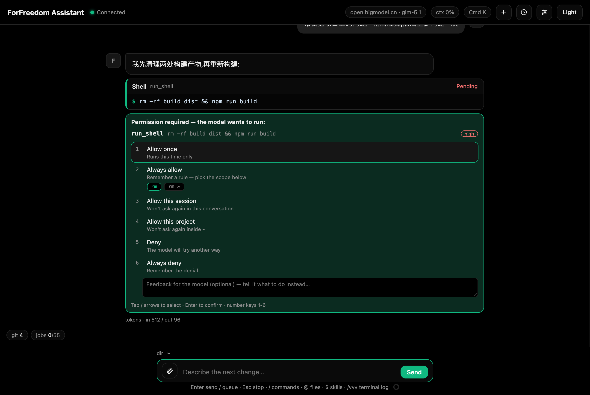

# 权限模式与审批

四种模式(`/mode <名>` 命令或 Ctrl+Shift+M 循环切换,切换时有 toast 提示;每会话独立记忆;设置里可固定选择)。**生成中也可以随时切换**(`/mode plan`、Ctrl+Shift+M、`/mode` 查看当前模式均不打断回复),新模式从下一回合生效:

| 模式 | 行为 |
| --- | --- |
| **plan** | 只读分析。禁止写文件;shell 命令一律要确认 |
| **build**(默认) | 安全操作自动执行;危险命令(rm、sudo、git push 等)要确认 |
| **edit** | 文件读写自动执行;所有 shell 命令要确认 |
| **yolo** | 全部自动执行(拒绝规则仍然生效,慎用) |

### 审批卡片

需要确认时消息流里出现权限卡,列出要执行的操作和风险等级(high 红 / medium 黄 / low 绿),下面是**编号选项列表**(单击选中、再单击应答;也可用键盘:↑↓/Tab 移动、Enter 确认、数字键 1-6 直接应答):

1. **Allow once** — 这次允许
2. **Always allow** — 允许并记住规则,下次自动执行。shell 命令会显示两个范围 chips:**精确**(命令主键,如 `git push`)或**前缀**(首词,如 `git *` 匹配一切 git 命令),点选后再应答;其他工具按工具名记忆
3. **Allow this session** — 本会话内不再询问(记在会话上,不进全局配置;之后同类请求直接自动放行并继续执行)
4. **Allow this project** — 本项目(当前工作目录)内不再询问,规则只在同目录的会话生效
5. **Deny** — 拒绝。行下方有**反馈输入框**:填一句"接下来该怎么做"(如"用 git clean 代替"),会以「用户反馈:」带给模型;Enter 提交、Esc 交还焦点
6. **Always deny** — 拒绝并记住,以后不再问

*图:消息流里的审批卡片,列出操作与风险等级,编号选项应答*

记忆的规则在 设置 > 工具与权限 里查看、增删;规则行有**项目**一列(留空 = 全局生效,填目录 = 仅该项目内生效)。规则类型:`command`(命令主键,如 `git push`)、`command_prefix`(前缀,如 `git`)、`tool`(工具名)。

