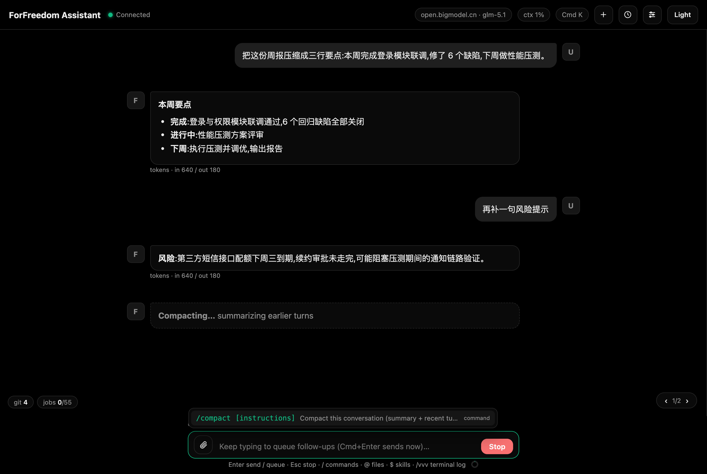

# 上下文管理与压缩

- 顶栏 `ctx` 徽章显示估算的上下文占用。**窗口大小自动跟随当前模型**:本地 llama-server 启动时探测真实上下文长度(按 `-c` 启动参数),云端模型按模型名识别(识别不到按 128k);也可在 ccswitch 供应商环境变量里配 `CLAUDE_CODE_CONTEXT_WINDOW` 显式指定。超过 85% 变红并弹提示。
- 点击徽章或 `/compact [补充说明]`:模型把之前的对话总结成摘要,保留最近几轮原文,历史替换为"已压缩"横幅。压缩本身消耗一次模型调用。长任务建议在 ctx 到 60-70% 时主动压缩。
- **压缩进行中**:消息流里出现 "Compacting…" 占位(完成那一刻变成带耗时的"已压缩"横幅,如 `12,345 tokens summarized in 9s`);期间**禁止发送消息**(输入会被提示等待,草稿留在输入框),Send 键变 **Stop**、Esc 可随时取消压缩,取消或失败原对话原样保留;会话列表同时显示运行点,多会话并行下其他会话不受影响。
- `/new` 直接开新会话是最彻底的清理。

*图:压缩进行中出现 Compacting 占位,完成后变为带耗时的已压缩横幅*

