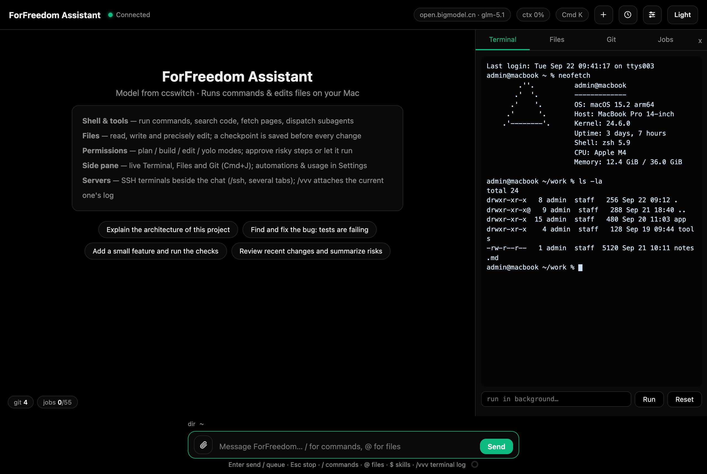
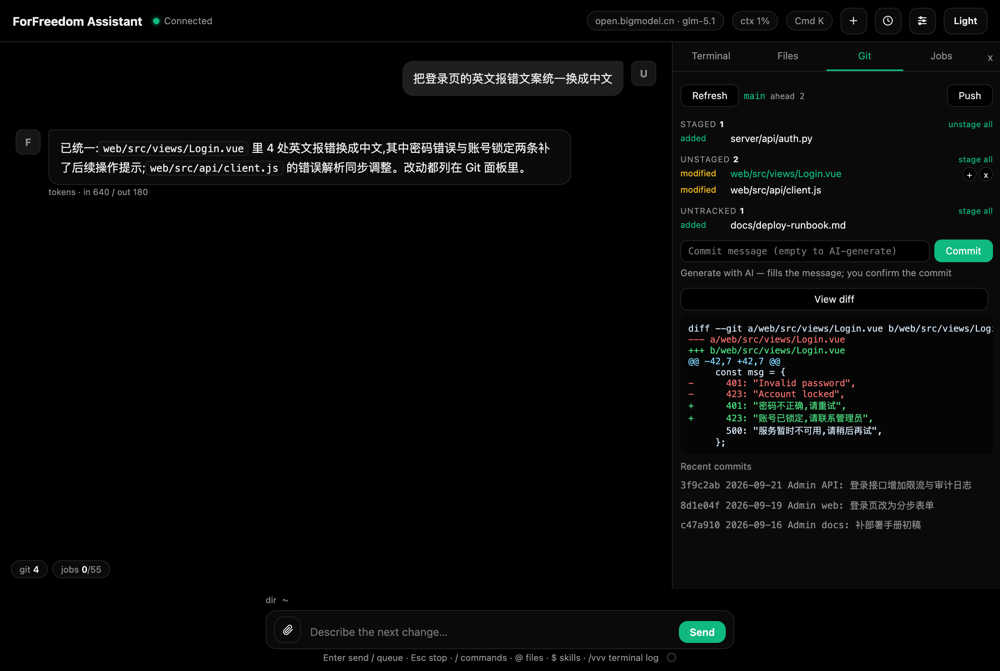

# 侧栏:终端 / 文件 / Git / Jobs

Cmd+J 或 `/terminal` 开关侧栏,四个标签:

### Terminal(交互式 PTY)

- 点击黑色区域获得焦点后**直接打字**——这是真的 zsh(登录 shell),支持方向键、Ctrl+C/D/L/U/A/E/W、Tab 补全、粘贴;有闪烁光标,Mac 键位(Delete、Cmd+Backspace 删行、Alt+Backspace 删词、Cmd+Left/Right 行首尾)与 SSH 终端一致。
- `run in background…` 输入框:把长命令丢到后台跑(不占终端),完成后状态浮层的 jobs 徽章可查输出。
- Reset 按钮杀掉并重启 shell(卡死时用)。
- top / htop / vim 这类全屏程序走备用屏按网格渲染(块光标),退出后回到滚动模式。

*图:侧栏 Terminal,真实 zsh 的 PTY 回显*

### Files

- 浏览任意目录(默认从会话工作目录开始),点目录进入、点文件查看。
- 文件预览:文本前 400 行,图片直接显示。
- Up / Refresh 导航。

### Git(Coding 模式专属)

- 顶行:Refresh、当前分支(点击开**分支切换器**)、同步状态(ahead N / behind M / up to date / no upstream)、**Push** 按钮;最近提交列表在底部。
- 改动列表分三段:**Staged / Unstaged / Untracked**(同一文件可以同时出现在前两段)。段头有计数和批量操作(unstage all / stage all)。悬停每一行出操作按钮:
  - `[+]` 暂存该文件(Staged 段没有 +)
  - `[−]` 取消暂存(仅 Staged 行)
  - `[x]` 丢弃:已跟踪文件恢复到暂存区版本,未跟踪文件直接删除;会先弹确认列出文件,不可撤销
  - 点行本体看该文件 diff。
- **Commit**:输入 message 后提交(自动 add 全部改动);**Generate with AI** 链接让模型读 diff + 最近提交风格生成一行提交信息填入输入框(变 Regenerate with AI 可重生成),你确认后才提交。
- **Push**:有上游且无新提交时直接提示 "Nothing to push";否则弹确认卡(分支 / 上游 / 同步状态;首次推送会自动建立 upstream 并说明)。推送中按钮变 Pushing…;失败时卡片内显示错误详情,可一键 Copy error;Esc 关闭。
- **分支切换器**:点分支名打开——搜索过滤、当前分支高亮、有未提交改动时提示数量(冲突会让切换失败)、底部输入新分支名 **Create & switch**(git checkout -b)。切换成功 toast 提示并刷新。
- View diff 看整体改动。

*图:Git 面板的改动列表与 diff 视图*

### Jobs(后台任务)

后台命令列表(Terminal 里 "run in background…" 启动的):每行显示命令与状态(running 黄 / exit 0 绿 / 非零红),点击查看输出。状态浮层的 jobs 徽章入口保留。

