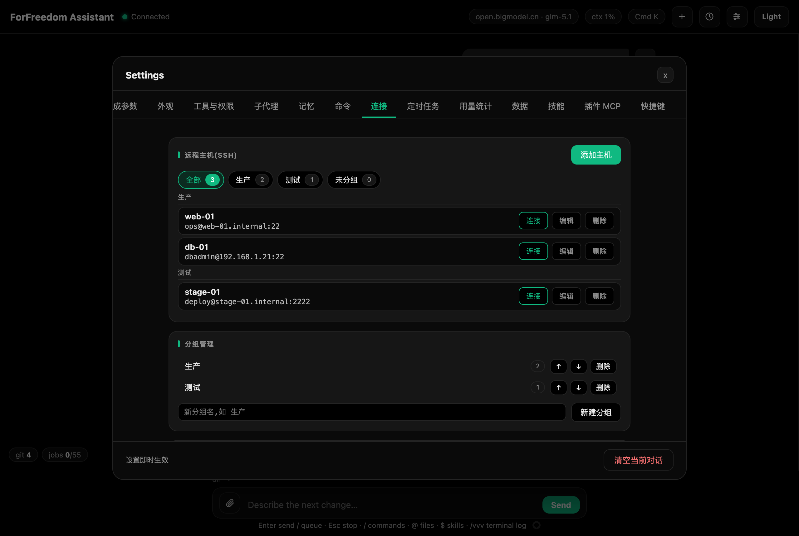

# 远程服务器(SSH)

连上服务器后主界面变**左右分栏:左边是服务器终端(占满窗口全高,可见行数约为上下分栏的三倍),右边照常对话**;未连接时界面与平时完全一样。终端是真实 PTY 里跑的系统 `/usr/bin/ssh`,与侧栏 Terminal 同一套渲染(闪烁光标、Mac 键位、全屏程序网格渲染、双击/拖拽选中后 **Cmd+C** 复制,选区在新输出到达时若选中段未变则原样保留)。


*图:连接后主界面左右分栏,左侧服务器终端、右侧照常对话*

### 连接管理

- **主机档案**:设置 > 连接 里维护(名称 / host / 端口 / 用户 / 私钥路径 / 跳板 / 复用时长分钟 / 分组 / 备注 / **密码(可选)**);主机列表每行两行式——名称一行、`user@host:port` 等宽第二行(悬停可看备注),行尾常显**连接 / 编辑 / 删除**三个按钮(连接绿色描边,删除悬停变红);点「添加主机」或「编辑」时表单卡展开在列表上方,保存即收起。`/sshhosts` 在对话里直接查看列表(输出不含密码)。
- **密码(可选,默认不存)**:填了就**明文**保存在本机 config.json(文件权限自动收紧为仅本人可读);设置里点该主机的**编辑**即可查看已存密码;留空保存即清除。连接时遇到 `password:` 提示会**自动填入一次**(有 toast 提示;密码错误不会重复自动填,之后的提示手动输入);MFA/OTP/keyboard-interactive 仍在终端里手输。
- **连接**:`/ssh <名称>`(名称或主机名唯一前缀)直接连;设置 > 连接 主机列表行尾的**连接**按钮同效。`/ssh` 不带名称则打开面板并给出指引。面板顶部只有标签条(多终端切换),没有别的按钮排——连接一律走命令或设置页。
- 连上后:顶栏出现 `ssh user@host` 徽章(带状态点,显示当前会话配对的终端;点击展开/收起面板,Cmd+4 同效);终端与对话之间的**竖直分隔条可拖拽调宽**(跟手:往右拖变宽、往左拖变窄,宽度会记住)、收起后再展开缓冲仍在;断线在屏幕尾显示退出码与 `/ssh <名称>` 重连提示。
- `/sshinfo` 查看当前会话配对的终端:sid、主机、ControlMaster 存活(复用列表为全局)、收发字节数。
- 本地侧栏终端(Cmd+J)不受影响,仍是本机 zsh。

### 分组管理

主机多起来后,可用 设置 > 连接 页的两处归置:

- **分组筛选 chips(主机卡顶部)**:「全部 N / 各分组(各带数量)/ 未分组 N」一排胶囊,点击即筛选下方主机列表;选中的 chip 绿色描边高亮,计数随之变实心绿。这就是浏览主机的首选入口,不用再翻长列表。
- **分组管理卡(页面底部)**:**新建分组**输入名称保存即建;**删除分组**后组内主机自动归入"未分组",不会丢任何主机;**调序**用分组行上的上、下箭头,主机列表的分节顺序随之变化。
- 主机表单里有**分组**下拉,新建/编辑主机时选择所属分组;不选就留在"未分组"。
- **不分组完全可用**:默认所有主机都在"未分组"里,不想分类可以完全不碰分组功能。



*图:设置 > 连接——分组筛选、主机列表与密钥管理*

### 密钥管理

设置 > 连接 页底部的**密钥管理(~/.ssh)**卡,列出本机 `~/.ssh` 目录下的全部公钥(名称、类型与位数、指纹、备注),每条可:

- **复制公钥**:把公钥内容复制到剪贴板,可直接贴到服务器的 authorized_keys 或代码托管平台。
- **填入表单**:把该密钥对应的私钥路径填进主机表单的私钥路径框,省去手敲路径。
- **删除**:删除该密钥;若有主机档案的私钥路径正引用它,会**拒绝删除并提示引用它的主机名**,先改掉那些档案再删。
- **生成新密钥**:选 ED25519(默认)或 RSA 4092,填个名称即可在 `~/.ssh` 下生成一对新密钥,备注自动写 `ff-<名称>`;已存在同名密钥会被拒绝,防止覆盖。

注意:这里只管理本机 `~/.ssh` 目录;生成的新密钥不含口令短语(免输口令更方便,需要口令短语请自行用 ssh-keygen 生成)。

### 终端与会话配对

SSH 终端标签条**全局**显示所有终端,每个终端与一个聊天会话 **1:1 配对**:

- **同时开多个终端**:再执行一次 `/ssh <名称>`(同一主机或不同主机都行)就会多一个标签;标签条末尾的 **"+"** 在当前终端的主机上一键再开(复用窗口内免二次认证;要换服务器就 `/ssh <另一台名称>`),点 "+" 开的第二个终端就是自动新开的第二个会话。
- **新开即配对**:当前会话还没配终端时,新终端直接绑给它;已配时自动新建一个会话来配。自动配对的会话若还是默认名"新对话",会自动改名为终端主机名(如 ops@shiyan)。
- **主机亲和,不串台**:会话记得它最后配对过的主机(重启也不忘)。**连同一台服务器**会复用该会话(继续历史);**连不同服务器**一定新开一个会话——昨天 A 服务器的旧会话不会被今天连的 B 收养,聊天区也不会再显示成 A 的内容。没有过任何终端配对的普通会话照旧可被收养。
- **切换双向跟随**:点终端标签,终端与下方聊天区一起切到它配对的会话;切聊天会话则激活它配对的终端,切回来时内容还在(无终端的普通会话照常对话,标签条里没有 active 项)。
- **关闭只解绑**:标签上的 `x` 关闭终端只解除配对,配对会话连同聊天记录保留,之后可再连新终端绑回;最后一个终端关闭后才收起面板。
- **删除会话即断开**:删除聊天会话会断开(dispose)其配对的终端。
- **刷新恢复**:刷新页面或重启应用后,各会话的存活终端按持久化的配对恢复成标签;旧版本遗留的无主终端,第一个归当前会话(当前会话未配对时),其余各自自动新建会话配对。
- **上限与作用域**:连接上限 8 个为**全局**终端总数;顶栏徽章显示当前会话配对的终端;`/download`、`/upload`、`/sshinfo` 都只作用于当前会话配对的终端(ControlMaster 复用列表为全局)。
- **断线标签**:状态点熄灭,徽章显示 `(off)`;重连 = 关掉该标签(`x`)再 `/ssh <名称>`(同机按亲和绑回原会话)。
- **本地终端全局唯一**:侧栏 Terminal(Cmd+J)不参与配对、不随会话切换,始终是同一个本机 zsh(创建时取当时会话的工作目录)。
- **大段粘贴可靠送达**:往终端粘贴长文本(SSH 与本地侧栏终端同理)走服务端写入队列,按块循环写满即背压等待,不再截断或把界面挂死;终端已断开时会 toast 告知"输入未送达"。注意操作系统层面的 tty 规格限制仍在(如 canonical 模式下单行长度上限),极长的无换行单行仍可能被远端系统丢弃,粘 heredoc 多行块最稳。

### MFA / 2FA 输入

- 密码(未存档案时)、OTP、keyboard-interactive 提示**直接在 SSH 终端里手输**(真实 PTY 交互)。回显关闭的输入不会进终端日志,也不会被引用功能带出去。
- **连接复用(ControlMaster)**:认证一次后,在主机档案"复用时长"窗口内,新开终端与上传下载都免二次认证;窗口过期后 `/download` 会报错并提示重新 `/ssh` 连一次。

### /download 与 /upload

- `/download <远端路径> [本地目的路径] [force]`:scp(SFTP 模式)拉文件,默认存到当前会话工作目录;**该目录不可写时(如根目录)自动改存到用户主目录**;目的文件已存在时需加 `force` 才覆盖。显式写的本地目的路径若是**相对路径,按当前会话目录解析**(不是按应用进程所在目录);目标目录实测不可写时直接报错并提示省略本地参数。
- `/upload <本地路径> <远端路径>`:把本地文件传上去;本地路径必须是存在的普通文件。
- **路径自动补全(免按 Tab)**:在 `/download`、`/upload` 后输路径时,候选即时出现在输入框上方——远端参数走当前终端的复用通道(`/api/ssh/complete`,相对路径按远端主目录解析,与 scp 同语义),本地参数从会话目录起查(绝对路径原样补)。**唯一目录候选自动下钻补 `/` 并继续列下一层;唯一文件候选自动把补全段展开为选区**,继续输入即覆盖,Enter 原样发送。路径含引号(带空格的路径)时不补全,Tab/Enter/上下键与命令面板一致。
- 路径含空格用引号包住;两条命令都走当前会话配对终端的复用通道,认证窗口内免二次登录。

### 命令门控

- 当前会话没有任何终端连接时,`/download`、`/upload` **不会出现**在 `/` 命令面板和 `/help` 列表里(避免误触);直接输入会提示先用 `/ssh` 连接;`/ssh`、`/sshhosts` 永远可用。当前会话连上终端后这两个命令自动回来。

### 快捷键

- **Cmd/Ctrl+Shift+T**:把终端新增内容抓成引用 chip(标注 TERM,可删),补上你的问题再发送——SSH 优先,无 SSH 时回落本地侧栏终端;偏移按终端分别记忆,切会话互不影响,刷新页面也不丢。密码 / OTP 因回显关闭天然不进日志;仍请避免把密钥、token 直接写在命令行里(普通命令会进日志)。可在设置 > 快捷键 改绑。

### 与外部终端工具配合(可选)

如果你习惯用 meatshell 这类外部 SSH 客户端,可在 设置 > 插件 MCP 配置它的 MCP 服务,让模型获得经其会话库执行远程命令、传文件的工具,例如:

```json
{"meatshell": {"command": "meatshell", "args": ["mcp", "serve"]}}
```

这与应用内 SSH 终端互不影响——应用内终端始终可用,两者可以并用。

## ops 模式:AI 直驱终端(回车即人审)

普通对话里模型只能「看」终端(输出由你主动抓取引用);ops 模式反过来——**模型驱动终端,你把关每一步**:模型把一条命令直接打进指定 SSH 终端的**输入行**,但**绝不代按回车**;你看过命令、亲自按回车,它才真正执行;输出自动读回给模型,模型分析后给下一步。每一步的执行权都在你手上,回车就是人审。

### 进入与退出

- **进入**:`/mode ops`,或 Ctrl+Shift+M 循环切换到 ops;`/mode ops <任务文字>` 一条搞定(切完模式余文直接作为任务发出)。**前提:至少一个在线 SSH 终端**(全局任意一台都算,不必是当前会话配对的);一个都没有时 `/mode ops` 会被拒绝并提示先用 `/ssh` 连接,Ctrl+Shift+M 循环时也会自动跳过 ops。
- **会话级粘性,但不外溢**:模式记在会话上,切走再切回还是 ops,不影响其他会话;ops 也**不会**写进全局默认模式,新建会话不会继承 ops。发送消息时若已无任何在线终端,该会话自动回落到你的默认权限模式并 toast 提示(重连终端后随时可再 `/mode ops`)。
- **本地 Mac 文件照常处理**:ops 模式下模型仍保有本地文件工具(读/列目录/搜索自动执行,写文件走审批卡确认)——连着服务器排查的同时,让它看改本机文件都没问题;`run_shell` 不在此列,命令执行仍只经终端 + 你回车。
- **Esc 不退出模式**:有等待回车的命令时,Esc 先**取消全部等待回车**(撤掉布防,并把已放进输入行的命令一并清掉,模式保留,照常对话即可);若该会话正在生成,流也一并停。要退出 ops,用 `/mode plan|build|edit|yolo` 显式切换。

### 链式循环:一步步怎么走

一个任务从头到尾就是「放命令 → 你回车 → 读输出 → 下一步」的循环,以「检查这两台的磁盘和 nginx 状态,有问题就修」为例:

1. **你说任务**:在对话里直接描述,像平时一样发送。
2. **模型说明并放命令**:模型在回复里说明这一步要做什么、在哪台终端做,然后把**一条命令**放进那台终端的输入行——命令出现在终端里,但**没有执行**(行尾没有回车)。
3. **你按回车**:看过命令没问题,就在那个终端里按回车执行;觉得不对可以自己改完再回车,或者不管它(不回车就不执行)。
4. **输出自动读回**:你回车的一瞬间,前端自动给模型发一条隐藏触发消息(时间线里不显示,也不进输入历史、不改会话标题),模型立即读取该终端的**输出增量**——等输出静默约 1.2 秒收口,不用你复制粘贴任何东西。
5. **模型分析与下一步**:模型根据输出决定下一台链式推进、本台再看一步,还是收尾总结;每一步都回到第 2 步,循环到任务完成。

多台终端时你只需要挨个回车:每一步模型都会说清放在哪台终端,回车后输出自动回来,循环自己往下走。

### 一步一条,多行仅 heredoc

- **每轮只放一条命令**:模型每一步只放一条,等你回车、读完输出才决定下一步;不会一次灌一串,也不会自己补回车。
- **多行命令仅限 heredoc 形态**(如 `cat > 文件 <<'EOF' ... EOF` 整体算一条);含回车符或多行的其他形态会被拒绝。
- **远程文件用 cat**:`cat 文件` 读、`cat > 文件 <<'EOF'` 写,都经终端完成,你回车前看得见完整内容;这是**服务器上**文件的读写方式,本地 Mac 文件用模型自带的本地文件工具(写走审批卡)。
- **密码/sudo/OTP 交互模型不碰**:遇到密码提示,模型会提示你自己在终端里输入,输完继续循环。
- **排障手册可用**:ops 模式下模型可以加载你安装的技能(如「nginx 排障手册」类 runbook),按手册步骤系统化推进;技能装载是纯读文本,不打审批卡。

### 多机对比:ops_broadcast 群发

排查集群问题最有效的手法是「同一条命令在多台机器上跑,找不一致的那台」。模型可以用 `ops_broadcast` 把**同一条命令一次放进多台终端**的输入行(同机分组仍然只放一台、自动去重),你逐台回车;每台回车后输出各自读回,模型把几台的输出摆在一起对比,直接指出哪台不一样。人审不变量不变:每台都得你亲自回车才执行,状态条会为每台各挂一个「等待回车」chip,可分别取消。

### 主机画像:开局先摸底(ops_facts)

模型排障开局可对每台在线主机调 `ops_facts` 采集画像:系统版本与内核、运行时长、根分区占用、内存、失败服务、进程 TOP(CPU/内存大户——**不是 systemd 管的服务也看得见**,手工起的、容器里的进程都在)、僵尸进程数(有才显示)、监听端口、docker 容器列表(`docker ps`,装了才有)、k8s 节点就绪状态与异常 Pod(检测到 `kubectl` 才采)。画像走**固定的只读探测命令**,借终端已认证的复用通道,不需要你回车。画像按主机缓存(默认 12 小时),之后的新会话在终端清单里直接带摘要(如「画像(3 小时前): Ubuntu 22.04 | 磁盘 84% | 服务状态 degraded」),不用每次重新摸底;模型也可强制重探。复用通道失效时探测会失败,提示先重新 `/ssh` 连一次即可。

### 多终端集群与尾部快照

- **一个 ops 会话驱动全部在线 SSH 终端**:模型每次收到你的消息时,都会拿到在线终端清单和**每台终端尾部 15 行快照**,因此它知道每台机器现在停在哪儿,可以逐台链式推进,也可以来回切换补看。
- **同一台机器的多个终端自动分组**:清单按「主机地址:端口」分组,同 IP 的多个终端视为同一台机器(同机多开)。模型对同机分组只**在其中一台**(组内第一个在线终端)放命令,不会逐个终端重复放,也不来问你;不同主机才逐台链式。同组内若有不同登录用户,清单会标注提醒模型注意权限差异。模型指认终端时可以直接用组标题(如 `10.0.0.8:22`)或唯一主机名,服务端自动落到组内第一个在线终端。
- **ops 中新开终端不抢会话**:ops 会话进行中再 `/ssh` 连一台新机器,新终端照常按配对规则归位(多数情况配一个新会话,当前会话名下没有终端且同机时直接绑给它),但**聊天区留在 ops 会话**不被切走(顶部会 toast 提示);模型下一轮清单里就能看到并直接驱动新终端。ops 会话名下没有配对终端时(比如刚关掉旧终端再连新服务器),面板自动回落显示第一台在线终端——面板、徽章与键盘始终对着某台真实终端,不会"不知道终端在不在";原本没在看任何终端时,连上新机器面板直接切到新终端。
- **点标签只切终端视图**:ops 会话中点终端标签,面板切过去看那台终端,聊天区留在 ops 会话不会被切走;Cmd+3 轮换终端同理。
- **放命令自动跟随**:命令放进哪台终端,面板自动切到那台(你正在全屏程序如 vim 中时不会抢,照常点标签即可);刷新恢复后若有等待回车的终端,面板也会直接切过去。
- **身份不明先 `ip a`**:多台机器角色不清时,模型的第一步通常是逐台放 `ip a`(或同类只读命令),你逐台回车,它据此建立各台的身份再往下走。
- 清单只含 SSH 终端;本地侧栏 Terminal(Cmd+J)不参与 ops。

### 长驻命令:「是否继续等待」怎么答

`top`、`journalctl -f`、压测这类长驻或慢输出命令,读取会等到超时(默认约 8 秒)先收一次,模型会在**正文里问你「是否继续等待」**:

- 答「继续」:模型再读一轮增量(游标不回退,已读过的不会重复);
- 答「不用了/够了」或直接说下一步:模型基于已有输出继续;
- 你也可以自己 Ctrl+C 结束命令,输出自然收口。

盯日志场景有更省事的方式:模型可以对 `tail -f`、`journalctl -f` 这类命令改用**盯输出**读取——带一个正则(如 `ERROR|Traceback`),新增输出一出现匹配就自动收口汇报,不用你来回答「是否继续等」。盯守缺省最长 120 秒(模型可按需调整,上限 600 秒),到点仍没命中会自动向终端发 Ctrl+C 停掉长驻命令,把已收到的输出全量带回再给结论;盯守期间你也可以随时点 ops 状态条上的**终止**按钮、或直接在终端按 Ctrl+C,同样立即收尾。

### 状态条与取消

- 对话输入区上方的 ops 状态条有两种提示:**等待回车 · 终端名**(命令已放入该终端,等你回车)与**读取输出中 · 终端名**(已回车,模型正在读输出,回合结束自动消失)。
- 「等待回车」chip 上的 **x** 只取消那一台的等待;**Esc** 取消全部等待回车。取消会把已放进终端输入行的命令一并撤走(发送清行键,输入行恢复空白),之后的回车不会再执行它;模式保留,继续对话即可。终端里正在跑全屏程序(vim/top 等)时,Esc 与回车都是程序按键、原样进终端,不会触发取消或读取。
- **多行粘贴自带回车语义**:终端正等回车时往里粘多行文本,视同按了回车——等待触发、模型读取输出,提示条不会卡住。
- 终端断开后,对应等待会被自动清掉(重连会换新终端,旧等待不会触发)。

### 刷新恢复

布防(哪台终端在等回车)按会话持久化:刷新页面或重启应用后,SSH 终端重挂完成时自动还原各会话的等待状态,状态条照常显示;已断开的终端对应等待会被清掉。终端屏幕本身也会从服务端留存的历史字节重建——等待回车的命令重挂后仍然显示在终端里,不会凭空消失。

### 与手动引用的分工

- **手动引用是你主动抓取**:Cmd/Ctrl+Shift+T 把终端新增抓成引用 chip 附进提问,只作用于当前标签的终端,抓一次是一次。
- **ops 是模型主动驱动**:进入 ops 后模型自己放命令、自己读输出,作用对象是全部在线 SSH 终端,循环自动推进。
- 两者可并用:ops 循环之外,你随时可以抓取引用补充某台的增量。

## aiops 模式:智能运维(只读免回车,写入人审)

ops 的排查加速变体:**纯排查命令免回车自动执行,任何写入/变更仍逐条等你回车**。适合「让模型自己把问题查清楚,人只把关修复动作」的场景——排查往往要跑几十条只读命令,逐条回车是最累的部分,而它们本来就没有风险;真正危险的写入一步都不会少审。

### 工作流:先排查、后结论、再修复

1. **排查(免回车)**:模型连发检查命令——`ps`、`df -h`、`journalctl -u nginx`、`kubectl get pods`、`tcpdump`、`strace` 及各种冷门诊断工具,**除写黑名单外一律连同回车一起自动执行**,输出自动读回,模型马上下一条,一路连续推进不等你。
2. **结论**:排查完备后模型先用正文给出结论与依据(哪个服务挂了、为什么、建议怎么改)。
3. **修复(逐条人审)**:然后把修复命令**一条一条**放进终端输入行——和 ops 完全一样,你看一条、回车一条,模型读输出再放下一条;多条修复命令绝不一次全放。

### 免回车怎么判(写黑名单,默认放行)

判定哲学(2026-09 按用户要求定型):**默认自动执行,只有明确改变状态或内容静态判不了的命令才转人审**。执行个命令、检查个东西不需要你回车;写状态的动作一步都不会少审。

- **逐段判定**:管道与 `&&`/`;`/`|` 链按段拆开,**每一段**都必须通过才自动执行;`sudo`、`timeout 10`、`VAR=x` 前缀视为透明;绝对路径取基名判动词(`/usr/sbin/iptables -t nat -S PREROUTING` 与裸 `iptables` 同判)。
- **未知命令默认放行**:`tcpdump`、`strace`、`ethtool`、`sysctl`(读)、`conntrack -L`、`smartctl`、`nmap`、`openssl s_client` 及一切没见过的诊断工具直接自动执行——不再要求它们出现在某个白名单里。
- **写动词黑名单(转人审)**,按改了什么分类:文件写/删/改(`rm`/`mv`/`cp`/`tee`/`dd`/`touch`/`mkdir`/`rsync`/`scp` 及 vim/nano 等编辑器)、权限(`chmod`/`chown`/`setfacl`)、进程(`kill`/`pkill`/`killall`)、服务与电源(`reboot`/`shutdown`/`swapon`/`modprobe`/`supervisorctl`/`launchctl`)、磁盘文件系统(`mkfs.*`/`fdisk`/`parted`/`fsck`/LVM/`zfs`)、网络配置(`ifconfig`/`nmcli`/`nft`)、包管理(`apt`/`yum`/`dnf`/`brew`/`gem`)、用户与调度(`useradd`/`passwd`/`at`)。
- **内容不可判定的代码类(转人审)**:解释器与数据库客户端(`python3 -c`/`node -e`/`mysql -e`/`psql`/`redis-cli`/`sqlite3`——`drop table` 能藏在参数里,静态判不了)、网络管道(`nc`/`socat`/`telnet`/`ssh 远程执行`)、构建部署(`make`/`go`/`cargo`/`helm`/`terraform`/`ansible-playbook`/`docker-compose`)、`source`/`eval`/`gdb`/`nsenter`。
- **curl/wget**:查询形态(GET)放行——健康检查端点、metrics 拉取;写方法(`-X POST`/`-d`/`--data*`)、上传(`-T`/`-F`)、落盘(`-o`/`-O`)转人审。
- **各工具的写形态特判**:`date -s`(设时间)、`hostname 带参`(设主机名)、`sysctl -w/--system`、`tcpdump -w`(写抓包文件)、`ethtool -s` 等、`conntrack -D/-F`、`fuser -k`、`arp -d`、`tc add/del`、`ipvsadm` 写旗标——查询形态放行,写形态转人审。
- **包装器与负载递归判**:`nohup`/`nice`/`watch`/`time`/`xargs`/`env`/`command` 这类命令转发型包装器,把内层命令再过同一套判定(`nohup rm`、`xargs rm`、`nice -n 5 reboot` 都拦得住);`kubectl exec`/`docker exec` 进容器的负载、`sh -c`/`bash -c` 的脚本字符串同样递归逐段判定——`exec pod -- cat Corefile`、`sh -c "grep ...; echo ---; grep ..."` 自动执行,夹 `rm`/`reboot`/写重定向照样转人审。
- **kubectl 按动词全集 + 变更黑名单判**:`get/describe/logs/top/diff/events/wait` 等直接放行;`apply/delete/edit/patch/scale/create/rollout restart` 等变更动词转人审;全集外的未知动词(可能是 kubectl 插件)也转人审;`auth/config/rollout` 只认只读子动词。
- **子命令白名单型 CLI**:`systemctl status/show/list-*`、`docker ps/logs/inspect`、`git status/log/diff`、`ip a/route`、`npm ls`、`pip list` 保留只认列出形态(这些工具的写子命令占一半,封闭集合逐个枚举);`systemctl restart`、`docker rm`、`git push` 一律转人审。
- **无害重定向放行,其余转人审**:`2>&1`(fd 复制)、`>/dev/null`、`2>/dev/null`(丢弃)、`</dev/null`(空 stdin)视为无害;写文件重定向(`>`/`>>`)、读入任意文件(`< f`,`mysql < dump.sql` 是导入写)、进程替换、`/dev/tcp`(网络通道)全部只放输入行。
- **整体转人审的结构**:写文件重定向、heredoc、命令替换 `$()`/反引号、后台 `&`、子 shell 括号、多行、超长命令——排查用不上,写入常借用,全部只放输入行。
- **取舍说明**:黑名单不可能穷尽天下写命令,没见过的第三方运维工具(迁移脚本、admin CLI)若不在黑名单里会直接执行;命令与输出都在终端里可见、有 toast 提示。这个闸门的定位是防呆不是安全边界,真正的把关是你在终端里看得到每条命令。

### 与 ops 的差异一览

| | ops | aiops |
| --- | --- | --- |
| 排查/检查命令 | 放输入行,等你回车 | **自动执行**(toast 提示「只读命令已自动执行」),不产生「等待回车」chip |
| 写入/变更命令 | 放输入行,等你回车 | 相同 |
| 排查节奏 | 一步一回车 | 连续推进,直到给结论 |
| 一轮一条限制 | 每轮一条,放完强制收轮 | 只读命令可连发;一旦放置了待回车的写入命令照旧强制收轮 |

其余一切与 ops 相同:进入需至少一个在线 SSH 终端(`/mode aiops`),会话级粘性、不写全局默认、无终端时自动回落;ops_facts 画像、长驻命令盯读、Esc 取消等待、刷新恢复、多终端清单与尾部快照全部共用;`ops_broadcast` 群发在 aiops 下同样只读免回车(逐台自动执行、逐台读回对比),写入仍逐台人审。

