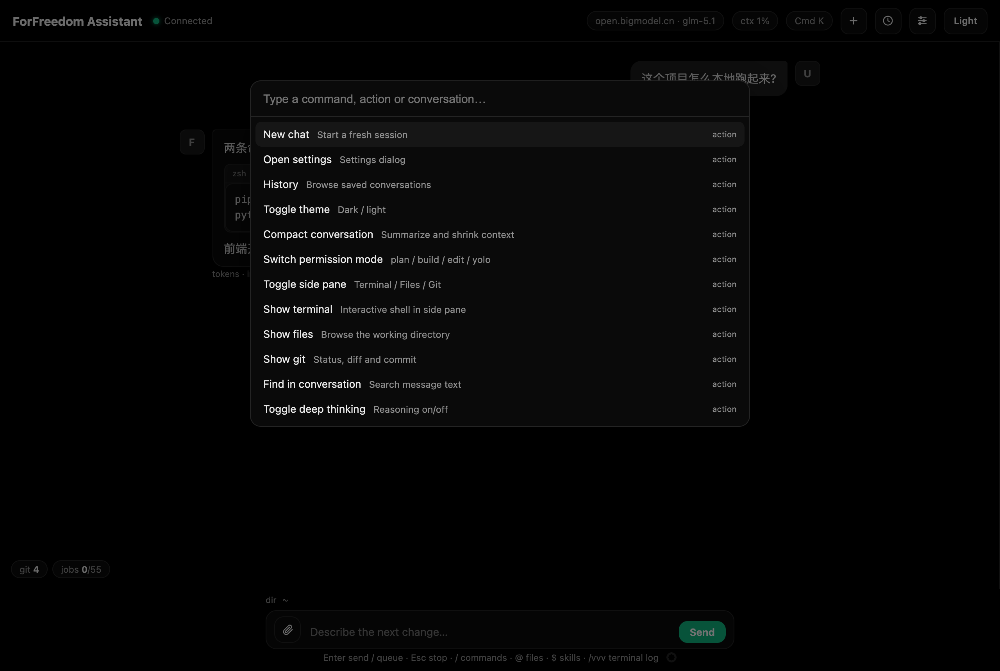

# 命令中心与斜杠命令

### Cmd+K 命令中心

模糊搜索所有:动作(新对话、压缩、切模式、开侧栏、回滚检查点、直达各设置页…)+ 全部斜杠命令 + 全部历史会话。↑↓ 选择,Enter 执行。



*图:Cmd+K 模糊搜索动作、斜杠命令与历史会话*

### 斜杠命令(/)

输入 `/` 即出建议面板。`/help` 看全部,`/help <命令>` 看单个:

| 命令 | 作用 |
| --- | --- |
| `/new` `/clear` | 新会话 |
| `/resume` `/history` `/continue` | 打开历史 |
| `/compact [说明]` | 压缩对话 |
| `/mode [名]` | 查看/切换权限模式 |
| `/goal …` | 目标管理(见上) |
| `/rewind [latest\|id\|status]` | 检查点回滚 |
| `/fork [latest\|id]` | 分叉会话 |
| `/init [补充]` | 让模型浏览项目并生成/更新 AGENTS.md |
| `/skill [名 [任务]]` | 技能列表 / 激活为 chip |
| `/agent [名 [任务]]` | 子代理列表 / 派发 |
| `/usage` | 用量统计 |
| `/effort` | 开关深度思考 |
| `/mcp` | 插件状态 |
| `/terminal` `/settings` `/model` | 开终端 / 设置 / 看当前模型 |
| `/ssh [名称]` | 连接服务器(无参弹主机选择;见"远程服务器 SSH") |
| `/sshhosts` `/sshinfo` | 主机列表 / 当前连接详情 |
| `/vvv <需求>` | 带当前终端日志提问(首次全量,之后增量;需已连终端) |
| `/download <远端> [本地] [force]` | 从服务器拉文件(需已连终端) |
| `/upload <本地> <远端>` | 往服务器传文件(需已连终端) |

行首顿号 `、` 会自动归一为 `/`。标注"需已连终端"的命令在当前会话没有 SSH 终端时不会出现在 `/` 面板与 `/help` 列表(见"命令门控")。

### 自定义命令

在 设置 > 命令 里新建自己的斜杠命令(`/ 面板、/help、Cmd+K 里都会出现):

- **名称**:英文标识,可用 `/` 分组(如 `deploy/prod` → 命令 `/deploy/prod`)。
- **描述** 与 **参数提示**(如 `[文件名]`)显示在面板里。
- **提示词** 支持占位符:`$ARGUMENTS` = 命令后带的全部参数原样代入;`$1` `$2` = 按空格/引号拆分后的第几个参数;都没写而带了参数时,参数自动附在提示词末尾("User arguments:" 段)。

发送 `/review src/app.js` 时,命令展开为完整提示词(以 "Run custom command /review." 开头)发给模型。可启停、编辑(改名会迁移停用状态)、删除;文件存在应用数据目录 `commands/*.md`,也可直接放文件进去。不支持 ```! / !` 动态 shell 展开(会明确报错)。

### 技能($)

输入 `$` 列出技能(名称+描述),↑↓ 选、Tab/Enter 选中。**选中后变成输入框上方的 chip**(可点 x 移除,随草稿保存),不再把技能文字打进正文。

发送时,chip 序列化为消息开头的 `$技能名` 令牌,服务端把该技能的 SKILL.md **全文**注入本轮——模型直接按技能办事,你不用复述技能内容。不带任务直接发也行,会默认"请按已激活技能的说明完成任务"。

系统提示里只保留技能**名单**(名称+描述);模型遇到匹配任务时可自行用 `skill` 工具按需加载其他技能全文,省 token。

`/skill` 无参列全部(含停用标记);`/skill <名>` 同样只挂 chip(提示 Skill armed);`/skill <名> <任务>` 挂 chip 并立即发送。技能 = `skills/<名>/SKILL.md`,设置 > 技能 里启停,点"打开技能目录"复制 example 自建。

### AGENTS.md 项目记忆

工作目录(或其父目录)有 AGENTS.md 时自动注入,让模型记住项目约定。`/init` 让模型自己写一份。

