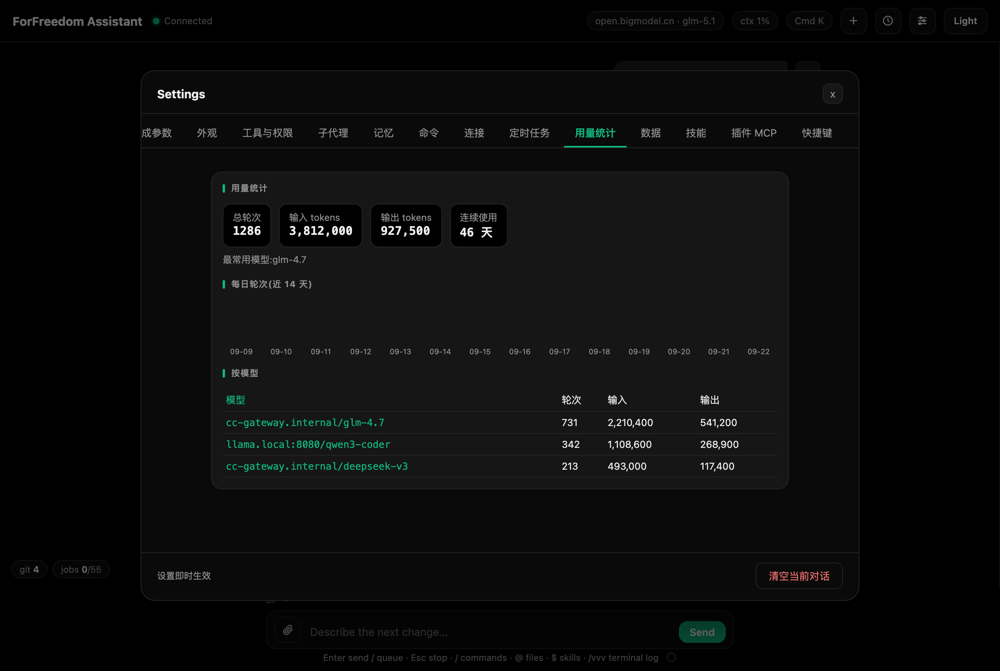

# 设置详解

Cmd+, 打开。十三个标签页(数据页改位置需重启完全生效,其余即时生效):

*图:Cmd+, 打开的设置抽屉*

1. **生成参数**:系统提示词(默认为 ZCode 原版系统提示词,英文;含沟通规范、上下文管理、安全声明与"用中文交流、禁 emoji、一步步引导操作"等本地规则——解决问题先分析、给结论与做法,再让用户一步一步执行,不一次堆一堆命令;每轮对话服务端还会自动附加当前工作目录、git 状态快照、日期等环境信息,不用自己写)、最大生成长度(256–65536,默认 8192;**ccswitch 优先**:环境变量 `CLAUDE_CODE_MAX_OUTPUT_TOKENS` 或 `ANTHROPIC_MAX_TOKENS` 存在时忽略滑杆)、最大工具轮数(1–64,默认 32;上下文耗尽是天然上限,64 顶格仅为防死循环兜底)、深度思考开关(Ctrl+T)。**采样参数(温度 / Top-P / Top-K)不在应用内设置**:本地模型按 llama-server 启动参数、云端模型用供应商默认,请求不携带采样参数。上下文窗口自动跟随当前模型(见"上下文管理与压缩")。
2. **外观**:深色(纯黑)/浅色主题;界面字号、代码字号(独立调节);**Coding / Office 界面模式**(Office 隐藏 Git、ctx 徽章等开发向内容,Cmd+Shift+U 快切);**运行中输入**(排队 / 引导,见"对话与输入");**系统通知**开关(默认开):窗口在后台时回复完成 / 出错 / 等待确认发 macOS 系统通知,点通知回到窗口;手动停止与转向不通知;关闭后不发。
3. **工具与权限**:工具总开关;四个权限模式;允许/拒绝规则编辑器(即"始终允许/始终拒绝"记忆的规则)。
4. **子代理**:列表 + 新建(见上文)。
5. **记忆**:查看与编辑模型的跨会话记忆(应用数据目录 `memory/`,与模型读写同一目录、同一格式)。列表列出全部记忆文件——**MEMORY.md 是索引**(带 index 标记),每行显示文件名、frontmatter 里的 description 描述与文件大小;点击任一条载入全文进入编辑(编辑时名称锁定),可保存、删除;下方表单可新建(名称 + 全文,全文可带 frontmatter)。记忆机制:**MEMORY.md 索引每回合注入,模型按需读取具体文件**,也会自动把重要事实沉淀到该目录;新建文件后记得回 MEMORY.md 索引补一行,保存后下回合生效。
6. **命令**:自定义斜杠命令的列表/启停/编辑/新建(见上文"自定义命令")。
7. **连接**:SSH 主机档案管理(见上文"远程服务器 SSH")——名称/host/端口/用户/私钥路径/跳板/复用时长/分组/备注/密码(可选:明文存本机 config.json 且权限 600,点"编辑"可查看,连接遇到 password 提示自动填一次,留空即清除),增删改查;主机卡顶部**分组筛选 chips**一点即筛、行内常显 连接/编辑/删除;底部**分组管理**卡新建/删除/调序分组、**密钥管理(~/.ssh)**卡查看、复制、填入表单、删除与生成密钥(见上文"分组管理""密钥管理");MFA/OTP 仍在连接后的终端里手动输入。
8. **定时任务**:列表 + 新建(见上文)。
9. **用量统计**:总轮次、输入/输出 tokens、连续使用天数、最常用模型、近 14 天每日轮次柱状图、按模型明细。数据存应用数据目录,只在本机。
10. **数据**:数据位置管理——顶部显示当前数据目录(等宽路径,「打开目录」在访达中打开);输入新位置点**应用并迁移**,把现有文件数据(配置 / 检查点 / 技能 / 子代理 / 命令 / 记忆 / 定时任务 / 用量 / MCP)整体搬到新位置并记住,重启后完全生效。数据目录默认 `~/ForFreedom`;非法路径(空、含控制字符、是当前的父/子目录、目标已有 config.json)会被拒绝并提示原因。**聊天记录存在浏览器 localStorage,不随本目录迁移**。
11. **技能**:技能启停 + 打开技能目录。
12. **插件 MCP**:JSON 配置 stdio 插件,如 `{"time": {"command": "uvx", "args": ["mcp-server-time"]}}`,保存后自动重连,状态实时显示。插件的工具与内置工具一样受权限系统管控。
13. **快捷键**:全部全局快捷键的改绑管理——点击键帽录制新组合(Esc 取消 / Backspace 恢复默认),冲突提示占用者并支持"仍要绑定"接管,垃圾桶清空为"未设置",支持文本或组合键搜索,一键全部恢复默认;绿色键帽表示已自定义。

*图:设置 > 用量统计,轮次、tokens、连续使用天数与模型明细*

底部"清空当前对话"只清消息,不动文件。

**没有模型配置页**——这是有意设计,模型永远由 ccswitch 管理(读 `~/.claude/settings.json`,每次请求重读)。顶栏徽章点击可看当前模型详情。

